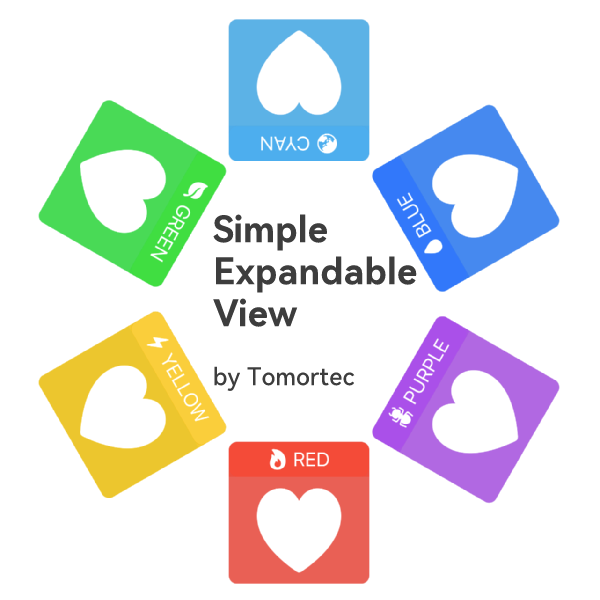
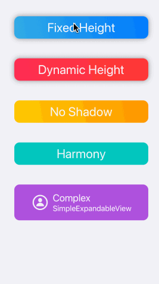
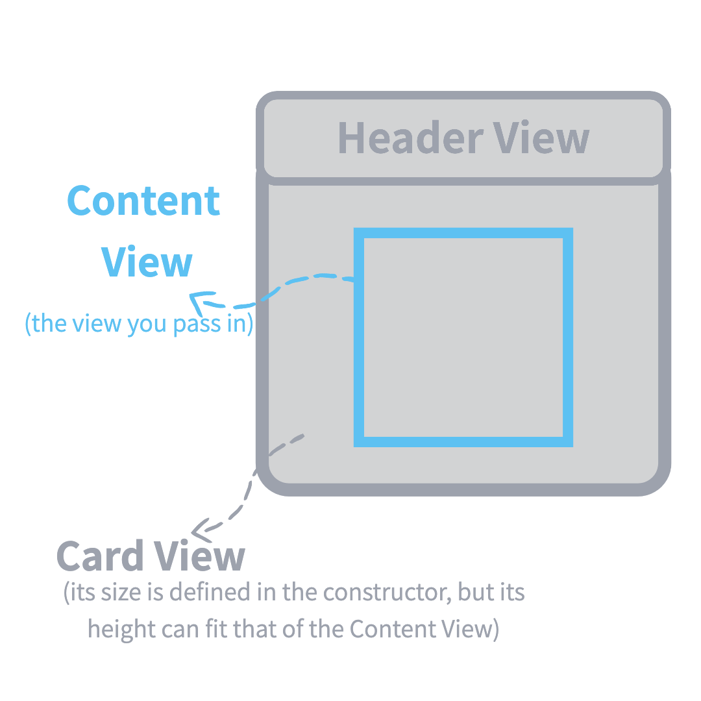

# SimpleExpandableView



 

## ExpandableView 结构


## 小示例

``` Swift
ExpandableView(
    headerSize: CGSize(width: 250.0, height: 50.0),
    cardSize: CGSize(width: 250.0, height: 250.0), header: {
        Text("Hello world")
            .foregroundColor(.white)
            .frame(maxWidth: .infinity, maxHeight: .infinity)
            .background(LinearGradient(colors: [.blue, .cyan], startPoint: .top, endPoint: .bottom))
    }, content: {
        VStack {
            Image(systemName: "heart.fill")
                .resizable()
                .frame(width: 180, height: 180)
            Text("Hi")
                .font(.title2)
        }
        .foregroundColor(.white)
    })
.cardBackgroundColor(.cyan)
.shadow(shadowRadius: 0.0)
.listRowSeparator(.hidden)
.frame(maxWidth: .infinity) // 居中
.padding(.vertical, 5.0)
```

克隆本仓库，在 `Example` 文件夹执行 `pod install` 后在 `Xcode` 运行示例项目来查看 demo

## ExpandableView 接口
### 初始化
``` swift
init(
    headerSize: CGSize,
    cardSize: CGSize,
    @ViewBuilder header: () -> Header,
    @ViewBuilder content: () -> Content,
    onTapped action: (() -> ())? = nil // 当 headerView 被点击时执行的操作
)
```

### 方法
``` swift
// 改变 header view 的背景颜色
func headerBackgroundColor(_ color: Color)

// 改变 card view 的背景颜色
func cardBackgroundColor(_ color: Color)

// 改变 header view 的圆角大小
func headerCornerRadius(_ radius: CGFloat)

// 改变 card view 的圆角大小
func cardCornerRadius(_ radius: CGFloat)

// 设置 header view 和 card view 的阴影
func shadow(shadowRadius: CGFloat = 6.0, color: Color = .gray, x: CGFloat = 0.0, y: CGFloat = 0.0)

// 使用 content view 的高度来确定 card view 的高度
func dynamicCardHeight()
```

## ExpandableViewsGroup 接口
### 初始化
``` swift
// 所有 ExpandableView 使用相同的 `headerView`
init<Header>(
    headerSize: CGSize,
    cardSize: CGSize,
    headerView:  () -> Header,
    contentViews: () -> [AnyView]
) where Header : View

// 使用泛型
init<Header, Content>(
    headerSize: CGSize,
    cardSize: CGSize,
    headerViews:  () -> [Header],
    contentViews: () -> [Content]
)  where Header : View, Content : View

// 使用 AnyView 数组
init(
    headerSize: CGSize,
    cardSize: CGSize,
    headerViews:  () -> [AnyView],
    contentViews: () -> [AnyView]
)

// 使用可变参数
init(
    headerSize: CGSize,
    cardSize: CGSize,
    headerViews:  AnyView...,
    contentViews: AnyView...
)
```

### 方法
``` swift
// 设置两个 `ExpandableView` 之间的空间
func verticalSpacing(_ spacing: CGFloat)

// 设置整个组的背景颜色
func backgroundColor(_ color: Color)

// 设置所有 header view 的背景颜色
func headersBackgroundColor(_ color: Color)

// 设置所有 card view 的背景颜色
func cardBackgroundColor(_ color: Color)

// 设置所有 header view 的圆角
func headerCornerRadius(_ radius: CGFloat)

// 设置所有 card view 的圆角
func cardCornerRadius(_ radius: CGFloat)

// 设置所有 header view 和 card view 的阴影
func shadow(shadowRadius: CGFloat = 6.0, color: Color = .gray, x: CGFloat = 0.0, y: CGFloat = 0.0)

// 将所有 `ExpandableView` 设置为 `.dynamicCardHeight()`
func dynamicCardHeight()
```

执行 Xcode 的 `Product > Build Documentation` 并前往文档中心来查看 `SimpleExpandableView` 的更多接口细节

## Swift 版本

Swift >= 5.0

## 安装方法

`SimpleExpandableView` 已在 [CocoaPods](https://cocoapods.org)发布。添加下列命令到你的 `Podfile` 来安装 `SimpleExpandableView`:

```ruby
pod 'SimpleExpandableView'

# 注意：如果您的 pod 没找到 `SimpleExpandableView`, 请使用下面的命令重试
# pod `SimpleExpandableView`, :git => 'https://github.com/Tomortec/SimpleExpandableView.git'
```

## 作者

Tomortec, everything@tomortec.com

## License

SimpleExpandableView is available under the MIT license. See the LICENSE file for more info.
